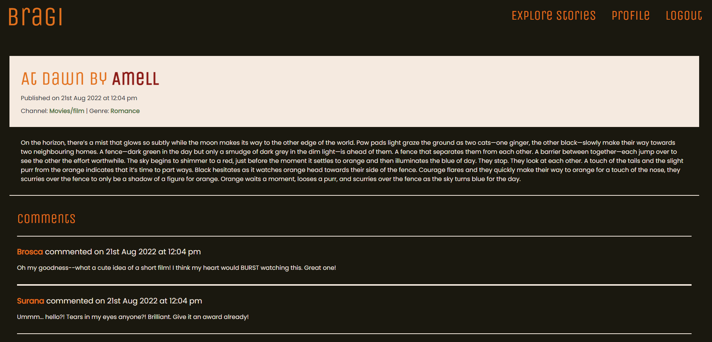

# Bragi


## Description

**Bragi: God of poetry and eloquence. The first recorded skald and son of Odin. Renowned for wisdom, and most of all for fluency of speech and skill with words.**

As the final project of the Adelaide University Full Stack Bootcamp, I decided to undertake the challenge of creating my own web application on my own--not in a group. My idea: to create a home for storytellers to come together in a community and share their stories with one another. This gave me the idea of Bragi--a web application named after a son of Odin known for his storytelling.

When a user first enters Bragi, they are shown a list of all the stories currently published by users. However, they are unable to peruse the stories until they either login or sign up. When they sign up, they are prompted to provide not just details such as an email address, username and password, but also to enter their preferred story genre and channel. These will show up on their profile, and they will be able to see other user's profiles to see their preferred story genres and channels.

Once logged in/signed up, the user will return to the list of stories and will be able to read them and comment on them. They will also be able to click on their own profile and publish their own stories, or click on another user's profile to see all their published stories.

> You can view the final, deployed application here: https://aqueous-reaches-17326.herokuapp.com/

## Table of contents

- [User story](#user-story)
- [Technologies used/built with](#technologies-usedbuilt-with)
- [Installation](#installation)
- [Usage](#usage)
- [Future development](#future-development)
- [Credits](#credits)
- [License](#license)

## User story

```
AS A storyteller
I WANT to be able to read, share and collaborate on stories
SO THAT I can connect with a community and open myself up to career opportunities in a storytelling industry.
```

## Technologies used/built with

This project used the following technologies to build it:

- HTML
- CSS
- JavaScript
- Node.js
- [Express.js](https://expressjs.com/)
- [MongoDB](https://www.mongodb.com/)
- [Mongoose](https://mongoosejs.com/)
- [Bootstrap](https://getbootstrap.com/)
- [React](https://reactjs.org/)
- [Apollo Server](https://www.apollographql.com/)
- [bcrypt](https://www.npmjs.com/package/bcrypt)
- [dotenv](https://www.npmjs.com/package/dotenv)
- [JWT](https://jwt.io/)


## Installation

1. Clone the repo (HTTPS: `git clone https://github.com/CharDige/Bragi.git` or SSH: `git clone git@github.com:CharDige/Bragi.git`)

2. Install all NPM packages by running `npm i` in the command-line. **Note:** this may take a whole as it will be installing the npm packages to build a React app.

## Usage

Below, you will find a screenshots showing my final web application.

> You can view the final, deployed application here: https://aqueous-reaches-17326.herokuapp.com/

### Final

*Home page*


*Log in and sign up pages*


*Logged in user's profile with ability to add stories, and remove current stories*


*A different user's profile, where user's can look at other user's profile details and stories*


*A single story*


*Comments on stories, showing that only logged in user's can delete their own comments*


## Future development

What is currently deployed is the minimum viable product (MVP) of this web application. However, there are many plans I have to create more functionality for this web application to bring more people together to share in their love of storytelling. This includes:

- Adding in the ability to update stories already published
- Adding in the ability for people to update their profiles to be more personal i.e. update their genres and platforms, as well as including a profile picture or anything else of interest.
- Allowing users to be able to collaborate on stories, so a writer may select for their story to be 'open for collaboration', which will allow other users to be able to pop in their own ideas and build on it.
- Allowing users to be able to connect with each other via direct messaging on the platform
- Having 'donate' and 'like/favourite' buttons in individual stories, so users can either 'like/favourite' a story (which would be listed on their profiles) or even donate to the author of the story, if that's something the user allows.
- Using an API for users to search through books/movies/video games/etc and select which ones they like/are currently going through/etc so that users can see this on their profiles.

There's probably plenty more things--There's a lot of potential for this to be a great website for storytellers!

## Credits

See below a list of websites I referred to that supported in the creation of Bragi:

- [Bootstrap docs](https://getbootstrap.com/docs/5.2/getting-started/introduction/)
- [Apollo Graph QL Studio/Sandbox](https://studio.apollographql.com/sandbox/explorer)
- [Dgraph - Delete Mutations in GraphQL](https://dgraph.io/docs/graphql/mutations/delete/)
- [Apollo Blog - A guide to authentication in GraphQL](https://www.apollographql.com/blog/backend/auth/a-guide-to-authentication-in-graphql/)
- [Back4App - Deleting an object through the Parse GraphQL API](https://www.back4app.com/docs/parse-graphql/graphql-mutation-delete-object)
- [React Bootstrap - Grid system](https://react-bootstrap.github.io/layout/grid/)

## License

[MIT License - Copyright (C) 2022 Charlotte Dige](./LICENSE)